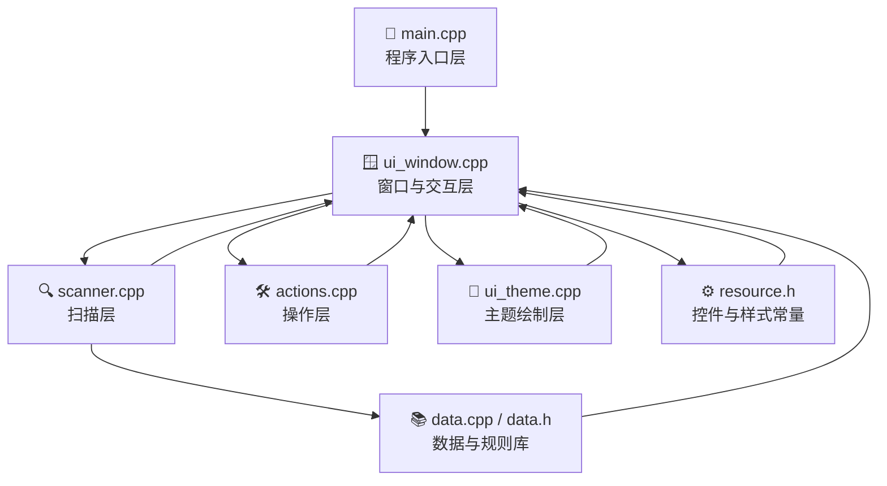
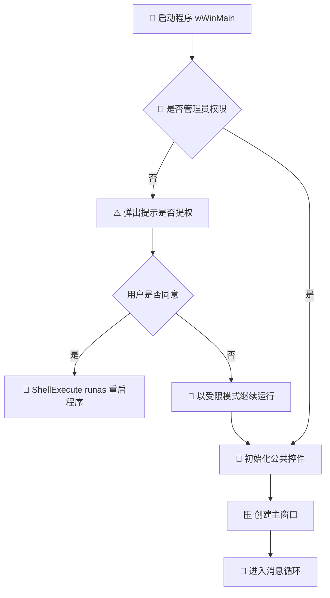
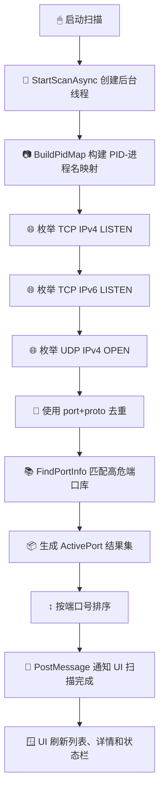
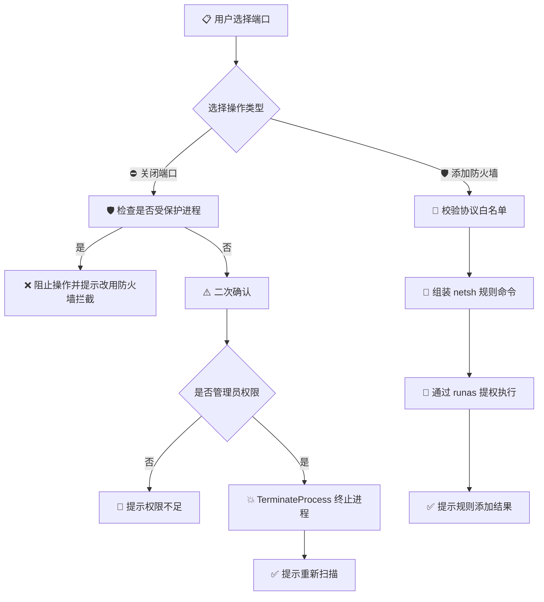
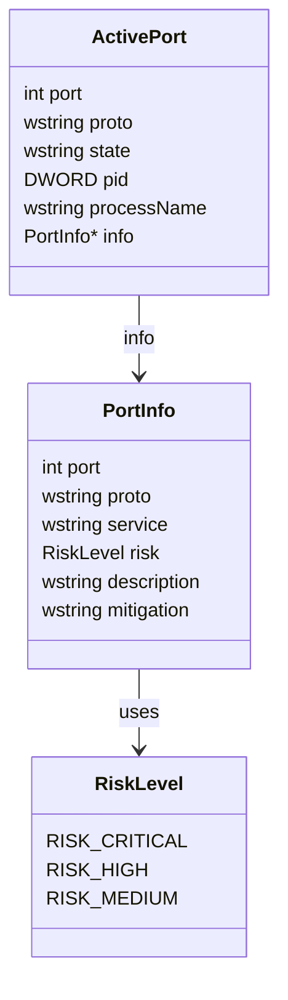

# 🛡 RiskPort-Analyzer 项目分析报告

> Windows 高危端口检测与管理工具正式汇报文档

---

## 📌 一、项目概述

### 1.1 项目背景
在 Windows 主机安全运维场景中，开放的监听端口往往是外部攻击进入系统的第一入口。许多高危服务端口，如 SMB、RDP、WinRM、数据库端口和容器管理端口，一旦错误暴露，极易引发远程代码执行、横向渗透、勒索传播或敏感数据泄露。

本项目 **RiskPort-Analyzer** 的目标，是构建一个面向本机环境的轻量级桌面工具，对当前系统正在监听的网络端口进行扫描与风险识别，并向用户提供可视化查看与快速处置能力。

### 1.2 项目定位
该项目属于：

- **本机端口暴露面审计工具**
- **Windows 原生 GUI 安全工具**
- **轻量级端口风险识别与处置程序**

它并不是：

- 远程漏洞扫描器
- 企业级持续监控平台
- 全面的主机入侵检测系统

项目聚焦于一个非常明确的闭环：

**端口扫描 → 风险识别 → 详情展示 → 风险处置**

### 1.3 核心能力

- 🔍 扫描本机 TCP / UDP 监听端口
- ⚠️ 使用内置高危端口数据库进行风险分级
- 📋 展示服务名称、危险描述、修复建议
- ⛔ 支持终止占用端口的进程
- 🛡 支持添加 Windows 防火墙阻断规则
- 🎨 提供深色安全终端风格的图形界面

---

## 🧰 二、技术栈与运行环境

### 2.1 开发技术栈

| 类别 | 说明 |
|---|---|
| 编程语言 | C++17 |
| UI 框架 | Win32 API + Common Controls |
| 系统接口 | Winsock2 / IP Helper API / ToolHelp32 / Shell API |
| 构建方式 | MinGW-w64 + g++ + Makefile |
| 运行平台 | Windows 桌面环境 |

### 2.2 核心系统能力来源

项目主要依赖 Windows 原生能力完成以下任务：

- **端口枚举**：通过 IP Helper API 获取 TCP / UDP 监听表
- **进程识别**：通过 ToolHelp32 快照建立 PID 到进程名映射
- **权限提升**：通过 ShellExecute 的 `runas` 触发 UAC 提权
- **防火墙配置**：通过 `netsh advfirewall` 添加入站阻断规则

### 2.3 构建依赖
根据 `Makefile`，项目链接的主要系统库包括：

- `ws2_32`
- `iphlpapi`
- `ole32`
- `comctl32`
- `shell32`
- `msimg32`

相关文件：

- `Makefile:8`
- `Makefile:24`

---

## 🏗 三、项目整体架构

### 3.1 架构说明
项目采用轻量级模块分层设计，虽然源码基本都位于仓库根目录，但职责划分比较清晰。整体可以分为以下几层：

- **入口层**：程序启动、权限检查、消息循环
- **数据层**：高危端口数据库与核心结构定义
- **扫描层**：端口枚举、进程映射、结果聚合
- **操作层**：关闭端口、防火墙拦截
- **UI 层**：窗口、控件、主题绘制与交互响应

### 3.2 架构分层图



### 3.3 项目目录结构

```text
PortScanner/
├── main.cpp          # 程序入口、消息循环
├── resource.h        # 所有控件ID、颜色、尺寸常量
├── data.h / data.cpp # 高危端口数据库 + ActivePort结构体
├── scanner.h/.cpp    # 端口扫描逻辑（工作线程）
├── actions.h/.cpp    # 业务操作：终止进程、防火墙规则
├── ui_theme.h/.cpp   # 自绘UI：背景、按钮、Banner、配色
└── ui_window.h/.cpp  # 窗口过程、控件创建、ListView刷新
```

相关文件：

- `structure.md:0`
- `README.md:74`

---

## 🔄 四、核心业务流程分析

本项目最重要的逻辑主线，是从系统实时状态中读取端口信息，结合规则库进行风险判定，再把结果展示到界面上，并允许用户执行处置动作。

### 4.1 启动与初始化流程

程序从 `wWinMain` 启动。首先检查当前是否为管理员权限；若不是，则弹窗询问是否以管理员身份重新启动。随后初始化公共控件，创建主窗口，并进入 Win32 标准消息循环。

相关位置：

- `main.cpp:35`
- `main.cpp:44`
- `main.cpp:60`
- `main.cpp:67`



### 4.2 端口扫描流程

扫描流程由 UI 触发，但实际在后台线程中执行。扫描器会先建立 PID 到进程名映射，再分别读取 TCP IPv4、TCP IPv6 和 UDP IPv4 监听端口。之后通过 `(port, proto)` 去重，并将每个端口与内置高危端口数据库进行匹配，最终生成 `ActivePort` 结果集回传给 UI。

相关位置：

- `scanner.cpp:31`
- `scanner.cpp:57`
- `scanner.cpp:67`
- `scanner.cpp:84`
- `scanner.cpp:101`
- `scanner.cpp:118`
- `scanner.cpp:148`
- `scanner.cpp:158`



### 4.3 风险处置流程

当用户从列表中选中某个端口后，可以执行两种操作：

- **关闭端口**：本质是终止占用该端口的进程
- **添加防火墙拦截**：本质是调用 `netsh advfirewall` 增加阻断规则

其中项目对系统关键进程做了保护，避免误杀造成系统崩溃。

相关位置：

- `actions.cpp:35`
- `actions.cpp:57`
- `actions.cpp:110`



---

## 🧩 五、主要模块职责说明

### 5.1 `main.cpp` —— 程序入口层

职责：

- 检查管理员权限
- 必要时以管理员身份重新启动
- 初始化公共控件
- 创建主窗口
- 进入消息循环

该文件职责单一，定位清晰，是整个程序的启动入口。

### 5.2 `data.h / data.cpp` —— 数据与规则库层

职责：

- 定义核心数据结构
- 提供风险等级枚举
- 维护高危端口数据库
- 提供风险查询与文本转换函数

其中 `DANGEROUS_PORTS` 是项目最重要的内置知识库之一。项目把常见高危端口的服务名、风险等级、危险描述、修复建议都编码到了静态数据表中。

相关位置：

- `data.h:17`
- `data.h:24`
- `data.h:34`
- `data.cpp:7`

### 5.3 `scanner.cpp` —— 扫描引擎层

职责：

- 采集系统端口监听状态
- 建立 PID 到进程名的关联
- 将系统实时信息与风险库关联
- 生成统一扫描结果
- 异步扫描并向界面回传结果

这是整个项目的核心业务处理层。

### 5.4 `actions.cpp` —— 风险处置层

职责：

- 识别受保护进程
- 终止进程
- 添加 Windows 防火墙规则
- 权限控制与用户提示

该模块不仅执行操作，也负责把危险边界控制住，例如不允许终止系统核心进程。

### 5.5 `ui_theme.cpp` —— 主题绘制层

职责：

- 定义深色终端风格 UI
- 绘制 Banner、按钮、背景和状态区
- 为不同风险等级的行设置不同配色

从实现看，界面风格采用了“深色背景 + 青绿强调色 + 风险颜色高亮”的安全工具视觉方案。

相关位置：

- `ui_theme.cpp:1`
- `ui_theme.cpp:37`
- `ui_theme.cpp:98`
- `ui_theme.cpp:149`
- `ui_theme.cpp:214`

### 5.6 `ui_window.cpp` —— 主界面与交互层

职责：

- 创建和布局子控件
- 维护界面状态
- 刷新端口列表
- 展示端口详情
- 接收扫描结果并更新状态栏
- 响应按钮、列表、尺寸变化等消息

它相当于界面控制器，是扫描层和操作层与用户之间的桥梁。

相关位置：

- `ui_window.cpp:45`
- `ui_window.cpp:89`
- `ui_window.cpp:106`
- `ui_window.cpp:133`
- `ui_window.cpp:254`
- `ui_window.cpp:319`

---

## 🗂 六、关键数据结构设计

### 6.1 风险等级 `RiskLevel`

定义位置：`data.h:17`

| 枚举值 | 含义 |
|---|---|
| `RISK_CRITICAL` | 严重风险 |
| `RISK_HIGH` | 高危风险 |
| `RISK_MEDIUM` | 中危风险 |

### 6.2 高危端口信息 `PortInfo`

定义位置：`data.h:24`

| 字段 | 含义 |
|---|---|
| `port` | 端口号 |
| `proto` | 协议类型，如 TCP / UDP |
| `service` | 服务名称 |
| `risk` | 风险等级 |
| `description` | 危险描述 |
| `mitigation` | 修复建议 |

### 6.3 扫描结果 `ActivePort`

定义位置：`data.h:34`

| 字段 | 含义 |
|---|---|
| `port` | 活动端口号 |
| `proto` | 协议 |
| `state` | 状态，如 LISTEN / OPEN |
| `pid` | 占用进程 PID |
| `processName` | 占用进程名 |
| `info` | 命中的高危端口信息，未命中则为空 |

### 6.4 数据结构关系图



### 6.5 数据关系说明

可以将两者理解为：

- `PortInfo`：静态知识库记录
- `ActivePort`：一次扫描得到的运行时结果

当扫描器发现某个监听端口时，会尝试按 `(port, proto)` 查询 `PortInfo`。如果命中，`ActivePort.info` 会指向对应规则；如果没命中，则说明该端口不在高危库中，界面会将其显示为“正常”。

---

## 🖥 七、UI 设计与交互特征

### 7.1 视觉风格
从 `resource.h` 和 `ui_theme.cpp` 可见，该项目的界面采用了较明确的安全工具视觉风格：

- 深色背景
- 青绿色强调色
- 顶部 Banner + 盾牌图标
- 风险等级颜色区分
- 详情区域使用等宽字体

相关位置：

- `resource.h:22`
- `resource.h:29`
- `resource.h:42`
- `ui_theme.cpp:98`
- `ui_theme.cpp:110`

### 7.2 配色策略

| 类别 | 颜色策略 |
|---|---|
| 应用主背景 | 深色蓝灰 |
| 强调色 | 青绿 |
| 严重风险 | 红色系 |
| 高危风险 | 橙黄色系 |
| 中危风险 | 蓝色系 |
| 正常项 | 常规浅色文字 |

### 7.3 交互特点

- 启动自动扫描
- 支持重新扫描
- 支持“仅高危 / 显示全部”切换
- 点击列表项后在底部查看详细说明
- 状态栏实时展示统计结果

这说明项目并非仅展示表格，而是设计了较完整的交互路径。

---

## ⚙ 八、构建、运行与使用方式

### 8.1 构建方式

根据 `README.md` 与 `Makefile`，项目主要支持以下方式：

#### 方式一：直接命令行构建

```bash
g++ -g main.cpp data.cpp scanner.cpp actions.cpp ui_theme.cpp ui_window.cpp \
    -o PortScanner.exe \
    -std=c++17 -mwindows -municode \
    -lws2_32 -liphlpapi -lgdi32 -lcomctl32 -lshell32 -lole32
```

#### 方式二：Makefile

```bash
mingw32-make
mingw32-make console
mingw32-make clean
```

相关位置：

- `README.md:121`
- `README.md:141`
- `Makefile:27`
- `Makefile:32`

### 8.2 运行方式

- 直接运行生成的可执行文件
- 建议使用管理员权限启动
- 启动后程序会自动进行一次端口扫描

### 8.3 典型使用流程

1. 启动程序
2. 自动或手动执行扫描
3. 在列表中选择端口
4. 查看端口详情与风险说明
5. 根据需要执行关闭端口或防火墙拦截

---

## ✅ 九、项目优势分析

### 9.1 功能闭环完整
项目把扫描、识别、展示、处置串成了完整链路，适合作为本机端口安全检查工具。

### 9.2 分层清晰，便于理解
文件职责边界比较明确，阅读成本低，适合教学、课程设计或小型安全工具开发。

### 9.3 原生实现，依赖轻量
项目没有引入大型框架，部署简单，运行环境要求清晰。

### 9.4 用户体验较好
- 异步扫描避免卡 UI
- 风险详情完整
- 状态栏统计直观
- 主题风格鲜明

### 9.5 具备基本安全边界控制
- 管理员权限校验
- 协议白名单校验
- 关键进程保护
- 重要操作二次确认

这些设计说明作者不仅关注功能实现，也考虑了误操作与安全边界。

---

## ⚠ 十、问题、不足与风险

### 10.1 风险识别以静态规则为主
当前风险识别依赖内置高危端口数据库，核心逻辑是按 `(port, proto)` 匹配。这种方式简单直接，但不具备更强的上下文判断能力，例如：

- 是否仅监听本地回环地址
- 是否实际暴露公网
- 是否启用认证
- 服务版本是否存在漏洞

因此该工具更适合“高危暴露面提醒”，而不是精确风险判定。

### 10.2 扫描覆盖仍有限
当前已实现：

- TCP IPv4
- TCP IPv6
- UDP IPv4

但没有看到 UDP IPv6 的扫描路径，覆盖面仍可进一步完善。

### 10.3 关闭端口方式较激进
所谓“关闭端口”，本质是直接终止占用端口的进程。这种实现简单有效，但在真实生产环境中可能带来业务中断或数据丢失风险。

### 10.4 全局状态较多
`ui_window.cpp` 中维护了多个全局窗口句柄和状态变量。对当前规模的小项目来说问题不大，但如果继续扩展，可能导致耦合度升高。

### 10.5 线程模型较原始
当前扫描线程基于 `CreateThread + PostMessage + new/delete` 实现，虽然可用，但线程生命周期和异常安全性都比较基础。

### 10.6 文档与构建细节存在轻微不一致
文档和实际构建信息之间存在少量细节差异，说明项目后续如果要交付或长期维护，需要进一步同步说明文档。

---

## 🚀 十一、改进建议

### 11.1 短期建议

- 将高危端口数据库外置为配置文件，提高可维护性
- 增加扫描结果导出功能，如 Markdown / CSV / TXT
- 增强错误信息与操作结果提示
- 增加更多端口信息筛选和排序能力

### 11.2 中期建议

- 减少全局状态，优化模块边界
- 引入更安全的线程封装与结果管理方式
- 将风险识别从“端口号匹配”扩展到“端口 + 进程 + 路径 + 签名 + 绑定地址”联合判断
- 支持查询与回滚已添加的防火墙规则

### 11.3 长期方向

- 支持历史扫描结果对比
- 支持本机安全基线检查
- 支持批量主机巡检或轻量代理模式
- 演进为更完整的主机暴露面审计工具

---

## 📝 十二、总结结论

总体来看，**RiskPort-Analyzer 是一个目标明确、结构清晰、实现直接的 Windows 本地高危端口分析工具**。

它的突出特点是：

- 功能定位清晰
- 模块分工明确
- 使用 Win32 原生技术栈实现完整 GUI 工具
- 能够形成从扫描到处置的完整使用闭环

从工程角度看，它非常适合作为：

- 课程设计项目
- 毕业设计原型
- Windows 安全工具练手项目
- 本机端口暴露面快速排查工具

如果继续完善其规则引擎、线程模型、配置管理和结果输出能力，该项目具备进一步工程化和实用化的空间。

---

## 📎 附录 A：关键源码文件索引

| 文件 | 作用 |
|---|---|
| `main.cpp` | 程序入口与权限控制 |
| `data.h / data.cpp` | 数据结构与高危端口库 |
| `scanner.h / scanner.cpp` | 扫描引擎 |
| `actions.h / actions.cpp` | 风险处置逻辑 |
| `ui_theme.h / ui_theme.cpp` | 主题绘制 |
| `ui_window.h / ui_window.cpp` | 主窗口与交互 |
| `resource.h` | 颜色、尺寸、控件ID等常量 |
| `Makefile` | 构建脚本 |
| `README.md` | 项目说明文档 |

## 📎 附录 B：报告中的 Mermaid 图索引

1. 项目整体架构图
2. 启动与初始化流程图
3. 端口扫描流程图
4. 风险处置流程图
5. 数据结构关系图

---

> 文档生成说明：本报告基于项目当前源码结构、README、构建文件与核心模块实现整理而成。